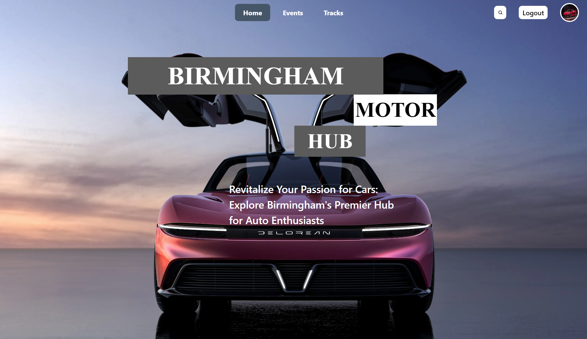

# ScreenTime Manager App **(STILL IN DEVELOPMENT)**
My Website is tailored to Car Hobbyists travelling to and visiting the city of Birmingham. One of my main motivations for making such a website is Birmingham's strong car community; with passionate individuals who appreciate classic cars and supercars
This README will guide you through the features and functionalities of the app, helping you get started and make the most out of it.

## Table of Contents
- Features
- Usage

# Features
ScreenTime Manager comes with a set of different features to help you manage your familys'' screen time effectively:

- Login and register: Allows the user to save and track race tracks the have visited
- Evennts
- Race tracks
- Race track preview
- Profile
- Way to save cars and track and view them

# Usage
Visit the website https://birminghammotorhub.netlify.app/

1. Create an Account: Sign up for a new account or log in if you already have one.
2. Have fun. Visit different car events and race tracks.
3. Save the cars and tracks you have raced on.
4. Share with your friends.

